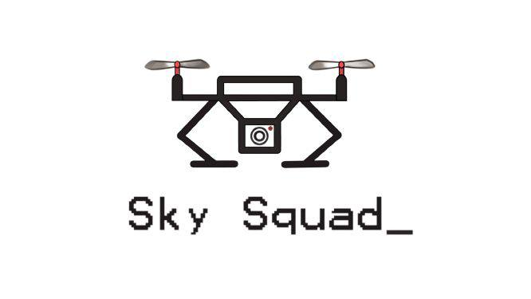
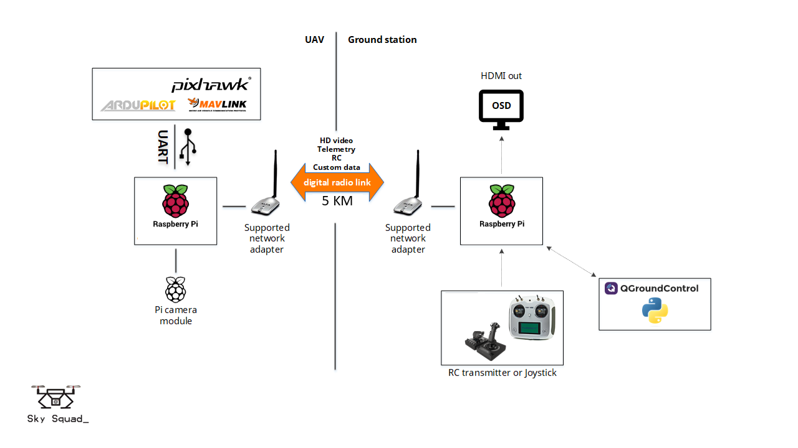

<!-- PROJECT LOGO -->
<br />
<div align="center">
  <a href="https://github.com/SkySquad/Drone_Aramco">
    
  </a>

  <h3 align="center">Uncontrolled Gas Leak Ignition using Drone</h3>

  <p align="center">
    <br />
    <a href="https://github.com/SkySquad/Drone_Aramco/tree/master/Code">View Code</a>    ·
    <a href="https://github.com/SkySquad/Drone_Aramco/tree/master/Gas%20detection">Gas detection</a>
    ·
    <a href="https://github.com/SkySquad/Drone_Aramco/tree/master/Invastigation">Invastigation</a>
  </p>
</div>


<!-- TABLE OF CONTENTS -->
<details>
  <summary>Table of Contents</summary>
  <ol>
    <li>
      <a href="#about-the-project">About The Project</a>
      <ul>
        <li><a href="#goal">Goal</a></li>
        <li><a href="#built-with">Built With</a></li>
      </ul>
    </li>
    <li>
      <a href="#hardware-and-software-used">Hardware and Software Used</a>
    </li>
    <li><a href="#minimum-viable-product">MVP</a></li>
    <li><a href="#project-highlights">Project Highlights</a></li>
    <li><a href="#simulation">Simulation</a></li>
    <li><a href="#license">License</a></li>
    <li><a href="#contact">Contact</a></li>
    <li><a href="#acknowledgments">Acknowledgments</a></li>
  </ol>
</details>


<!-- ABOUT THE PROJECT -->
## About The Project
Offshore Drilling / Inspection Department
Currently, Saudi Aramco has several offshore platforms and drilling wells. The uncontrolled gas release event is one of the scenarios that requires immediate mitigation. The last resort of mitigation is to use handheld flare gun to ignite gas cloud manually by operator(s) which could impose risks to individual and environment.
### Goal
Develop drone-based ignition system that is controlled remotely to safely and effectively ignite uncontrolled gas leaks: <br> ● Cost effective and efficient drone-based solution that can be launched 5km away from the gas leak zone  <br> ● Remotely controlled using controller or base-station operating at ISM frequency bands  <br> ● The controller should have HD display to view camera feed & telemetry data, control onboard ignition/re-ignition system and manage flights mission.  <br> ● The drone camera should support navigation, aiming and ignition  <br> ● Imbedded/onboard AI/ML to detect proper gas cloud mixture for accurate navigation, aiming and ignition. <br>  ● The solution shall have autonomous navigation and return-home function.

<p align="right">(<a href="#readme-top">back to top</a>)</p>


## Requirements
To run this project the following are needed for AI . Furthermore, a Dronekit must be installed.Pymavlink to connect with Drone. For shirt detection opencv, cv2  must be installed on the system.

> **Requirements list (+ all dependencies!) (python2.7):**
> - Dronekit (https://github.com/dronekit/Dronekit-python)
> - keras (http://www.keras.io)
> - theano (http://deeplearning.net/software/theano/)
> - opencv (http://opencv-python-tutroals.readthedocs.io/en/latest/py_tutorials/py_tutorials.html)
<p align="right">(<a href="#readme-top">back to top</a>)</p>


<!-- Hardware and Software Used -->
## Hardware and Software Used

This is an example of how you may give instructions on setting up your project locally.
To get a local copy up and running follow these simple example steps.

<a href="https://github.com/SkySquad/Drone_Aramco">
    
  </a>
<p align="right">(<a href="#readme-top">back to top</a>)</p>

## Run the project
If you have all requirements as defined above you can simple run the project by entering:
```
$ python drone.py
```
This contains the main file of the drone. Please make sure that you have an active connection to the drone via wifi.


<!-- MVP -->
## SkySquad Software 

A software designed to manage the mission and save the mission details for further investigation.

_For more clarification, please refer to the [SkySquad Software](https://github.com/SkySquad/Drone/tree/master/SkySquad%20Software)_

<p align="right">(<a href="#readme-top">back to top</a>)</p>


<!-- LICENSE -->
## License


This porject is sponsored by The Saudi Federation for Cybersecurity, Programming and Drones , Tuwaiq Drone Challenge

<p align="right">(<a href="#readme-top">back to top</a>)</p>


